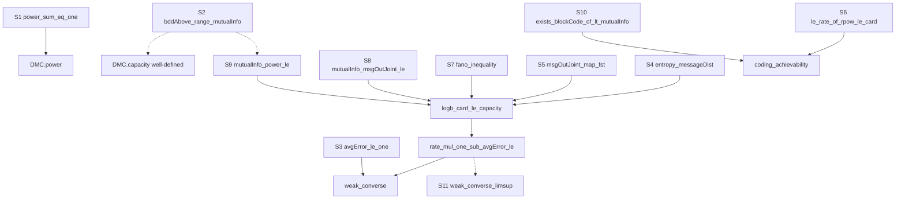

# GOAL — finite DMC coding theorem

Review artifact for the opening session. **Nothing here is settled.** Every
convention below is a draft for the information-theory collaborator to accept,
amend, or reject. No individual `sorry` has been attempted.

- **Scope:** the coding theorem for **finite discrete memoryless channels** —
  finite alphabets, average block-error probability, achievability strictly
  below capacity, weak converse above it. Not general/continuous channels, not
  Shannon–Hartley, not zero-error capacity, not the strong converse.
- **State:** `lake build` succeeds. 11 `sorry`s, all named and precisely typed.
  Both top-level theorems are *fully proved from those `sorry`s* — the
  connecting arguments are real Lean proofs, not placeholders.
- **Toolchain:** Lean 4.32.2, Mathlib v4.32.2.

---

## 1. Top-level statements

Verbatim from the source; both compile.

```lean
/-- Achievability (direct part). -/
theorem coding_achievability [Nonempty X] (W : DMC X Y) {ε : ℝ}
    (hR : R < W.capacity) (hε : 0 < ε) :
    ∀ᶠ n : ℕ in atTop, ∃ c : BlockCode X Y n, R ≤ c.rate ∧ c.avgError W ≤ ε
```

```lean
/-- Weak converse, R-form (primary). -/
theorem weak_converse (W : DMC X Y) {R : ℝ} (codes : ∀ n, BlockCode X Y n)
    (hrate : ∀ n, R ≤ (codes n).rate)
    (herr : Tendsto (fun n ↦ (codes n).avgError W) atTop (𝓝 0)) :
    R ≤ W.capacity
```

```lean
/-- Weak converse, limsup-form (the brief's draft shape; derived, still `sorry`). -/
theorem weak_converse_limsup (W : DMC X Y) (codes : ∀ n, BlockCode X Y n)
    (hbdd : BddAbove (Set.range fun n ↦ (codes n).rate))
    (herr : Tendsto (fun n ↦ (codes n).avgError W) atTop (𝓝 0)) :
    limsup (fun n ↦ (codes n).rate) atTop ≤ W.capacity
```

Supporting definitions, all **concrete** — no `sorry` hides a definitional
choice:

```lean
structure DMC (X Y : Type*) [Fintype X] [Fintype Y] where
  transition : X → PMF Y

structure BlockCode (X Y : Type*) [Fintype X] [Fintype Y] (n : ℕ) where
  card     : ℕ
  card_pos : 0 < card
  encode   : Fin card → Fin n → X
  decode   : (Fin n → Y) → Fin card

noncomputable def entropy [Fintype α] (p : PMF α) : ℝ :=
  -∑ a : α, (p a).toReal * Real.logb 2 (p a).toReal

noncomputable def condEntropy (μ : PMF (α × β)) : ℝ :=            -- H(A ∣ B)
  entropy μ - entropy (μ.map Prod.snd)

noncomputable def mutualInfo (μ : PMF (α × β)) : ℝ :=             -- I(A ; B)
  entropy (μ.map Prod.fst) + entropy (μ.map Prod.snd) - entropy μ

noncomputable def DMC.power (W : DMC X Y) (n : ℕ) : DMC (Fin n → X) (Fin n → Y) where
  transition x := PMF.ofFintype (fun y ↦ ∏ i, W.transition (x i) (y i)) …

noncomputable def DMC.capacity (W : DMC X Y) : ℝ :=
  sSup (Set.range fun p : PMF X ↦ W.mutualInfo p)

noncomputable def BlockCode.rate (c : BlockCode X Y n) : ℝ := Real.logb 2 c.card / n

noncomputable def BlockCode.avgError (c : BlockCode X Y n) (W : DMC X Y) : ℝ :=
  (c.card : ℝ)⁻¹ * ∑ m, c.condError W m
```

---

## 2. Convention choices — all DRAFT, none settled

| # | Choice | Rationale / what to push back on |
|---|--------|----------------------------------|
| **D-1** | Scope: average error, direct + weak converse only. | Per brief. Maximal error would need expurgation; nothing is built for it. |
| **D-2** | `[Fintype X] [Fintype Y]` are parameters of `DMC` itself; `[Nonempty X]` is added **only** to `coding_achievability`, where it is genuinely needed (to know the set of achievable mutual informations is nonempty). | Alternative: bake `[Nonempty X] [Nonempty Y]` into `DMC` so "finite nonempty alphabet" is one notion. I kept it minimal so the hypothesis is visible where it does work. |
| **D-3** | Blocks are **`Fin n → X`**, not `Vector X n`. | `Fin n → X` is automatically a `Fintype`; `∏ i, W (y i ∣ x i)` is a plain `Finset.prod`; Mathlib's own docs call the `List.Vector` API "quite incomplete". **This deviates from the brief's illustrative signature.** |
| **D-4** | Base 2 throughout (`Real.logb 2`); `0 * log 0 = 0` obtained from Lean's junk value `log 0 = 0`. | Makes `entropy` total with no support hypothesis and no case split. It is the standard convention, but note it arrives as a *junk value* rather than a stated convention. Verified by a real proof: `entropy (PMF.pure a) = 0`. |
| **D-5** | `mutualInfo` and `condEntropy` are defined by **inclusion–exclusion** (`I = H(A) + H(B) − H(A,B)`), not as a relative entropy `∑ p log(p/q)`. | This is the single most load-bearing choice. It involves **no division**, so no hypothesis about a conditioning event having positive mass can ever be silently needed, and the chain rule `H(A) = I(A;B) + H(A∣B)` becomes literally `ring`. Cost: identification with the KL form becomes a lemma to prove later, not a definition. |
| **D-6** | One distribution type: `PMF` over a `Fintype`. Reals are extracted with `ENNReal.toReal` at point of use. | `PMF` is `ℝ≥0∞`-valued, so *some* friction is unavoidable; `.toReal` is total and lossless here (a `PMF` is never `∞`). Alternative: carry a bespoke real-valued `FinDist`. I would not recommend it. |
| **D-7** | Capacity is `sSup`, never `max`. | Per brief. Attainment is a separate later theorem needing compactness of the simplex; it is *not* a prerequisite for stating capacity. **Consequence:** `bddAbove_range_mutualInfo` must be proved or `sSup` silently returns the junk value `0`. |
| **D-8** | Message set is `Fin c.card` with `c.card : ℕ`; rate is `logb 2 card / n`; and the size comparison is written **one way everywhere**: `(2 : ℝ) ^ ((n : ℝ) * R) ≤ (c.card : ℝ)`, with `Real.rpow`. | Directly targets the bookkeeping hazard in the brief. **No statement anywhere mentions a floor or a ceiling.** `Nat.ceil` is allowed to appear inside a future construction, never in a type. **Deviates from the brief's `Message : Type` + `Fintype`.** |
| **D-9** | `BlockCode X Y n` does **not** mention the channel; the channel enters only via `condError` / `avgError`. | A code is a code regardless of the channel. Cost: `c.avgError W` rather than `c.avgError`. **Deviates from the brief's `BlockCode (W : DMC X Y) n`.** |
| **D-10** | Weak converse stated primarily in **R-form**; the limsup form is a separate statement carrying an explicit `BddAbove` hypothesis. | **This is a soundness flag, not a taste preference.** `Filter.limsup` on `ℝ` is an `sInf`, so for a rate sequence unbounded above it evaluates to the junk value `0` and `limsup ≤ C` would hold *vacuously*. The brief's draft limsup form is, as written, weaker than it looks. |
| **D-11** | Deterministic encoder and decoder; uniform messages; error probability as a `Finset` sum over the output block, not `PMF.toMeasure`. | Everything in sight is a `Fintype`, so measure theory buys nothing here. |
| **D-12** | Achievability is pure existence. | `exists_blockCode_of_lt_mutualInfo` asserts a code exists; its intended proof is random coding (bound the ensemble average, then note some realisation beats the average). **No usable encoder comes out of it**, and nothing downstream should be phrased as if one does. |

Deviations from the brief's illustrative signatures: **D-3, D-8, D-9** (and
D-10 as a correction). These are the ones to reject first if you disagree.

---

## 3. The `sorry` list

11 `sorry`s. Classification uses the brief's categories. Note which categories
came out **empty** — that is itself a result:

- **Definition:** none. Every definition is concrete, so no `sorry` can hide a
  definitional choice from review.
- **Construction:** none. `DMC.power` is a real construction; only its
  normalisation obligation is deferred (S1).
- **Algorithm:** none, by design (D-12).
- **Measurement / External fact:** none. Everything below is intended to be
  proved in-repo, not imported from the literature.

### Lemmas

| id | name | type | forced by |
|----|------|------|-----------|
| **S1** | `power_sum_eq_one` | `∑ y : Fin n → Y, ∏ i, W.transition (x i) (y i) = 1` | well-definedness of `DMC.power` |
| **S2** | `bddAbove_range_mutualInfo` | `BddAbove (Set.range fun p : PMF X ↦ W.mutualInfo p)` | well-definedness of `DMC.capacity` (D-7) |
| **S3** | `BlockCode.avgError_le_one` | `c.avgError W ≤ 1` | `weak_converse` |
| **S4** | `BlockCode.entropy_messageDist` | `entropy c.messageDist = Real.logb 2 c.card` | `logb_card_le_capacity` |
| **S5** | `BlockCode.msgOutJoint_map_fst` | `(c.msgOutJoint W).map Prod.fst = c.messageDist` | `logb_card_le_capacity` |
| **S6** | `BlockCode.le_rate_of_rpow_le_card` | `0 < n → (2:ℝ) ^ ((n:ℝ) * R) ≤ (c.card : ℝ) → R ≤ c.rate` | `coding_achievability` |

### Theorems

| id | name | type | forced by |
|----|------|------|-----------|
| **S7** | `BlockCode.fano_inequality` | `condEntropy (c.msgOutJoint W) ≤ 1 + c.avgError W * Real.logb 2 c.card` | `logb_card_le_capacity` |
| **S8** | `BlockCode.mutualInfo_msgOutJoint_le` | `mutualInfo (c.msgOutJoint W) ≤ mutualInfo (c.inOutJoint W)` | `logb_card_le_capacity` |
| **S9** | `DMC.mutualInfo_power_le` | `(W.power n).mutualInfo q ≤ n * W.capacity` | `logb_card_le_capacity` |
| **S10** | `exists_blockCode_of_lt_mutualInfo` | `R < W.mutualInfo p → 0 < ε → ∀ᶠ n in atTop, ∃ c : BlockCode X Y n, (2:ℝ) ^ ((n:ℝ) * R) ≤ (c.card : ℝ) ∧ c.avgError W ≤ ε` | `coding_achievability` |
| **S11** | `weak_converse_limsup` | see §1 | stated, not yet attempted |

S7 is Fano's inequality (the `1` is the crude bound `h₂(Pe) ≤ 1`). S8 is the
data-processing inequality for `M → Xⁿ → Yⁿ`, stated **specialised to the code
setting** rather than for an abstract Markov chain — a general DPI would need a
Markov-chain notion nothing yet demands. S9 is single-letterisation.

**S10 is by far the largest** and is the only one that is really a research-sized
obligation: it is achievability at a fixed input distribution, i.e. the entire
random-coding + joint-typicality argument. It is deliberately left undecomposed,
because decomposing it means inventing the ensemble and typicality definitions,
which the brief defers. Splitting it is the natural next review question.

### Proved outright (no `sorry`)

These are the connecting arguments, and they are real proofs:

- `entropy_map_fst_eq_mutualInfo_add_condEntropy` — the chain rule
  `H(A) = I(A;B) + H(A∣B)`; by `ring`, thanks to D-5.
- `logb_card_le_capacity` — the whole converse chain
  `log₂|M| = H(M) = I(M;Yⁿ) + H(M∣Yⁿ) ≤ I(Xⁿ;Yⁿ) + H(M∣Yⁿ) ≤ nC + 1 + Pe·log₂|M|`,
  assembled from S4, S5, S7, S8, S9.
- `BlockCode.rate_mul_one_sub_avgError_le` — the per-block-length bound
  `rate · (1 − Pe) ≤ C + 1/n`, consumed by both asymptotic forms.
- `coding_achievability` — from S6 and S10.
- `weak_converse` — from S3 and the two lemmas above, including the limit
  argument.

### Dependency graph



Dotted edges are expected dependencies of `sorry`s not yet attempted.

---

## 4. Hazards found while stating things

Each is flagged, not patched.

1. **`limsup` junk value.** See D-10. The brief's draft converse is weaker than
   intended as written. This is the one place where I changed the *meaning* of a
   drafted statement rather than its presentation.
2. **`sSup` junk value.** With capacity as a supremum (D-7), `DMC.capacity` is
   `0` unless S2 holds. So S2 is not bureaucratic: **S9 cannot be proved without
   it**, since `I ≤ n·C` needs `le_csSup`, which needs `BddAbove`. This is the
   concrete form of the brief's "supremum vs. maximum" warning — the risk is not
   assuming attainment, it is `sSup` quietly being `0`.
3. **Logarithm positivity in S6.** Proving `R ≤ rate` from
   `2^(nR) ≤ card` needs monotonicity of `logb 2`, hence positivity of both
   arguments. `card_pos` is available in `BlockCode` and must actually be used —
   this is exactly the "log rule invoked without checking positivity" case.
4. **Independence is constructed, not assumed.** `DMC.power`'s transition law
   *is* the product `∏ i, W (y i ∣ x i)`, verified `rfl`. Nothing assumes
   product-coordinate independence. The one place where independence will have
   to be *constructed* rather than read off is the i.i.d. input ensemble `pⁿ`
   inside S10 — that does not exist yet.
5. **Mathlib has no discrete Shannon entropy.** It has `Real.negMulLog`, a
   binary entropy function, and a measure-theoretic Kullback–Leibler divergence,
   but no entropy or mutual information for distributions on a `Fintype`. So
   `FiniteDMC.Entropy` is unavoidable, not a preference. Worth knowing that this
   layer may eventually be worth upstreaming.
6. **No `Nonempty Y` anywhere.** It is never needed: `Y` is inhabited implicitly
   by the existence of `W.transition x : PMF Y`. Flagging in case you want it
   stated anyway for symmetry.

---

## 5. Anticipated but NOT in the Lean file

Deliberately absent, because no proof attempt has forced them yet. Listing them
so the omission is visible rather than an oversight:

- `avgError_nonneg`. Obviously true and obviously wanted — but after factoring
  out `rate_mul_one_sub_avgError_le`, nothing consumes it. It was written, found
  to be unused, and removed rather than left in to pad the graph.
- **"Some realisation beats the average"** — the pigeonhole step
  `(∑ i, μ i · f i ≤ b) → ∃ i, μ i ≠ 0 ∧ f i ≤ b` that makes random coding
  non-constructive. It belongs inside S10.
- The i.i.d. input ensemble `pⁿ`, the joint-typicality set, and its quantified
  estimates. All inside S10.
- Attainment of capacity (`∃ p, I(p;W) = C`), continuity/concavity of
  `mutualInfo`, and the identification of D-5's `mutualInfo` with the KL form.
  All later, all separate.

---

## 6. What is actually verified

`lake build` is green. Beyond "it typechecks", `FiniteDMC/Sanity.lean` contains
four closed statements with real proofs, guarding the conventions a reviewer
would otherwise have to take on trust:

- `entropy (PMF.uniformOfFintype Bool) = 1` — entropy really is in **bits** (D-4).
- `entropy (PMF.pure a) = 0` — the `0 log 0 = 0` convention really holds, with
  no support hypothesis (D-4).
- `(W.power n).transition x y = ∏ i, W.transition (x i) (y i)` by `rfl` —
  memorylessness is definitional (D-3).
- `(W.power 1).transition x y = W.transition (x 0) (y 0)` — the length-1
  extension is faithful.

---

## 7. Questions for review

1. Reject or accept the three deviations from the brief's signatures: **D-3**
   (`Fin n → X`), **D-8** (`Fin card` + the rpow size convention), **D-9**
   (code independent of channel).
2. **D-5** is the highest-leverage choice in the repo. Is inclusion–exclusion
   the definition you want as canonical, with the KL form derived — or the
   reverse?
3. **D-10**: confirm the R-form should be primary and the limsup form should
   carry `BddAbove`.
4. Should **S10** be split now (which means committing to ensemble and
   typicality definitions), or left whole until the rest of the graph is closed?
5. Which `sorry` should be attempted first? S1, S3, S4, S5, S6 look like
   self-contained warm-ups; S7–S9 are the real information theory; S10 is a
   project of its own.
